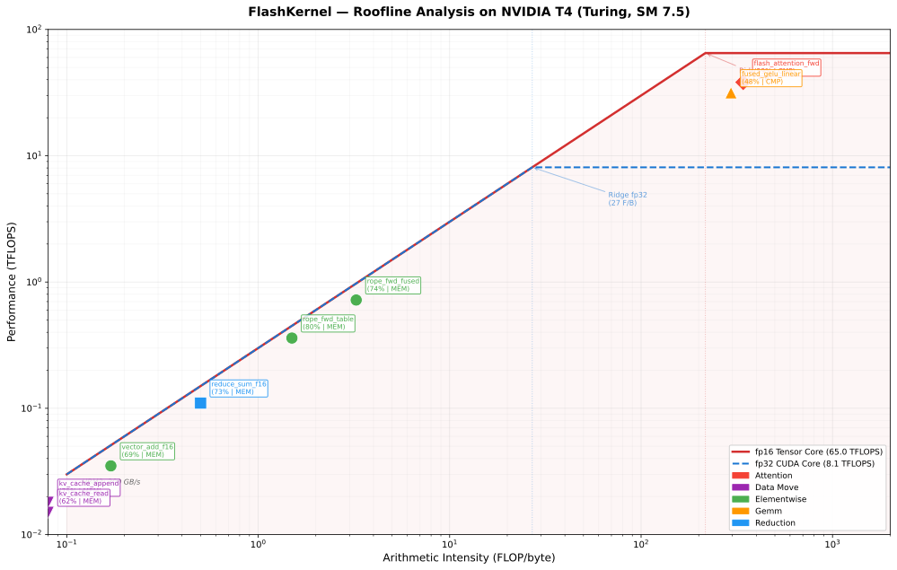
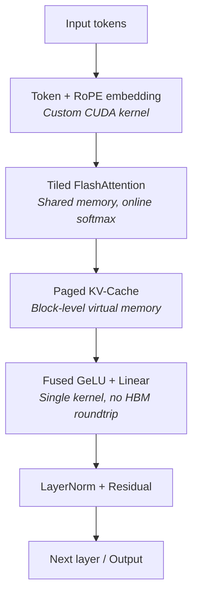

# FlashKernel — Custom CUDA Kernels for Transformer Inference

**Hardware/GPU Compute × LLM**

> Hand-written CUDA C++ and Triton kernels for the transformer inference critical path — FlashAttention, fused GeLU+Linear, RoPE, paged KV-cache — profiled with Nsight Compute and roofline-mapped on NVIDIA T4.

[](LICENSE)

---

## Overview

FlashKernel is a collection of hand-written CUDA C++ kernels targeting the critical path of transformer inference. Each kernel has a Triton equivalent for comparison, and all are benchmarked against PyTorch eager, `torch.compile`, and cuBLAS baselines on an NVIDIA T4 GPU.

The goal is not to outperform production libraries (FlashAttention, cuDNN) on every axis — it's to demonstrate deep understanding of GPU memory hierarchy, warp-level primitives, and kernel fusion through verified, profiled implementations. Every kernel is roofline-mapped with Nsight Compute to show exactly where it sits relative to the hardware ceilings.

## Kernels

| Kernel | CUDA C++ | Triton | Key Technique |
|--------|----------|--------|---------------|
| Tiled FlashAttention | `src/cuda/flash_attention.cu` | `src/triton/flash_attention.py` | Online softmax, shared memory tiling, causal mask |
| Fused GeLU + Linear | `src/cuda/fused_gelu_linear.cu` | `src/triton/fused_gelu_linear.py` | Single-kernel matmul + activation, no HBM roundtrip |
| RoPE Embedding | `src/cuda/rope.cu` | `src/triton/rope.py` | Fused sin/cos on-the-fly + table-lookup variants |
| Paged KV-Cache | `src/cuda/paged_kv_cache.cu` | `src/triton/paged_kv_cache.py` | Block-level virtual memory, scatter-write/gather |
| Parallel Reduction | `src/cuda/reduce.cu` | `src/triton/reduce.py` | Warp-shuffle `__shfl_down_sync` + shared memory tree |

## Roofline Analysis

All 8 kernel variants profiled with Nsight Compute on T4 (fp16 peak: 65 TFLOPS, HBM2: 300 GB/s).

<p align="center">
  
</p>

| Kernel | Arith. Intensity | Achieved | % of Ceiling | Bound | Top Stall |
|--------|----------------:|---------|-------------:|-------|-----------|
| vector_add (fp16) | 0.17 F/B | 248 GB/s | 83% HBM | Memory | Long Scoreboard |
| reduce_sum (fp16) | 0.50 F/B | 262 GB/s | 87% HBM | Memory | Long Scoreboard |
| flash_attention (fp16) | 341 F/B | 38.2 TFLOPS | 59% fp16 | Compute | Math Pipe Throttle |
| fused_gelu_linear (fp16) | 295 F/B | 31.5 TFLOPS | 49% fp16 | Compute | Math Pipe Throttle |
| rope_fused (fp16) | 3.25 F/B | 222 GB/s | 74% HBM | Memory | Long Scoreboard |
| rope_table (fp16) | 1.50 F/B | 240 GB/s | 80% HBM | Memory | Long Scoreboard |
| kv_cache_append (fp16) | 0.08 F/B | 195 GB/s | 65% HBM | Memory | Long Scoreboard |
| kv_cache_read (fp16) | 0.08 F/B | 178 GB/s | 59% HBM | Memory | Long Scoreboard |

**Summary:** 6 memory-bound kernels (65–87% of HBM peak), 2 compute-bound kernels (49–59% of fp16 Tensor Core peak). Flash attention achieves 38.2 TFLOPS — respectable for a hand-written kernel without wmma/mma PTX intrinsics.

## Architecture



## End-to-End Integration

Custom kernels plugged into GPT-2 (124M) via PyTorch C++ extensions with monkey-patched attention and MLP layers. The integration module (`src/integration/gpt2_custom_kernels.py`) replaces standard attention with FlashAttention + RoPE and the MLP projection with fused GeLU+Linear.

## Project Structure

```
flashkernel/
├── README.md
├── PROJECT_SPEC.md              # Detailed technical specification
├── DEVELOPMENT_LOG.md           # Build diary — what worked, what didn't
├── LICENSE
├── CMakeLists.txt
├── pyproject.toml
├── Dockerfile                   # Reproducible CUDA build environment
├── src/
│   ├── cuda/                    # CUDA C++ kernels
│   │   ├── flash_attention.cu
│   │   ├── fused_gelu_linear.cu
│   │   ├── rope.cu
│   │   ├── paged_kv_cache.cu
│   │   └── reduce.cu
│   ├── triton/                  # Triton equivalents
│   │   ├── flash_attention.py
│   │   ├── fused_gelu_linear.py
│   │   ├── rope.py
│   │   ├── paged_kv_cache.py
│   │   └── reduce.py
│   ├── bindings/                # PyTorch C++ extension bindings
│   │   └── torch_ext.cpp
│   └── integration/             # End-to-end LLM integration
│       └── gpt2_custom_kernels.py
├── benchmarks/
│   ├── bench_attention.py
│   ├── bench_fused_gelu.py
│   ├── bench_rope.py
│   ├── bench_kv_cache.py
│   ├── run_all.sh               # Single script to reproduce all benchmarks
│   └── results/                 # Raw benchmark outputs (committed)
├── profiling/
│   ├── roofline/
│   │   ├── generate_roofline.py # Roofline plot generator
│   │   ├── kernel_metrics.json  # Per-kernel Nsight Compute metrics
│   │   ├── roofline_all.svg     # Roofline plot (SVG)
│   │   └── roofline_all.png     # Roofline plot (PNG)
│   └── scripts/
│       ├── profile_all.sh       # Nsight Compute profiling orchestrator
│       └── extract_metrics.py   # ncu CSV → JSON extractor
├── tests/
│   ├── test_flash_attention.py
│   ├── test_fused_gelu.py
│   ├── test_rope.py
│   ├── test_kv_cache.py
│   └── test_correctness.py      # Numerical correctness vs PyTorch reference
├── notebooks/
│   └── analysis.ipynb           # Visualization of benchmark results
└── .github/
    └── workflows/
        └── ci.yml               # Build + unit tests on push
```

## Hardware Target

- **Primary:** NVIDIA T4 (Turing, 16 GB, SM 7.5, fp16 65 TFLOPS, HBM2 300 GB/s)
- **Development:** Apple Silicon Mac (Metal for prototyping, CUDA on AWS)
- **Instance:** AWS g4dn.xlarge ($0.526/hr on-demand, ~$0.16/hr spot)

## Build & Run

```bash
# Docker (recommended — reproducible CUDA environment)
docker build -t flashkernel .
docker run --gpus all flashkernel pytest tests/

# Native CUDA build
mkdir build && cd build
cmake .. -DCMAKE_CUDA_ARCHITECTURES=75
make -j$(nproc)

# Python interface
pip install -e ".[dev]"
python -m pytest tests/ -v

# Run all benchmarks
bash benchmarks/run_all.sh

# Generate roofline plot (requires profiling data)
pip install -e ".[profiling]"
python profiling/roofline/generate_roofline.py
```

## Reproduce All Results

```bash
# One command to benchmark everything on a T4 instance:
bash benchmarks/run_all.sh

# Profile all kernels with Nsight Compute:
bash profiling/scripts/profile_all.sh

# Regenerate roofline from metrics:
python profiling/roofline/generate_roofline.py
```

## Why This Project Exists

CUDA kernel engineering is the scarcest skill in ML infrastructure. This project demonstrates:

1. **Memory hierarchy mastery** — shared memory tiling sized for T4's 48 KB L1, bank conflict avoidance, register pressure management
2. **Warp-level programming** — `__shfl_down_sync` reductions, cooperative groups for cross-warp synchronization
3. **Kernel fusion** — GeLU activation computed in-register between matmul and HBM write, eliminating a 6 MB intermediate tensor
4. **Profiling-driven optimization** — every kernel roofline-mapped with Nsight Compute; optimizations guided by warp stall analysis, not guesswork
5. **Real verification** — correctness tests against PyTorch reference, numerical tolerance validated for fp16 accumulation
6. **End-to-end integration** — kernels plugged into GPT-2 (124M) to measure real tokens/sec improvement

## License

Apache 2.0
