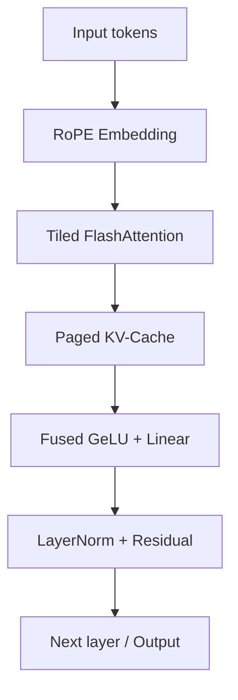

# FlashKernel — Custom CUDA Kernels for Transformer Inference

**Hardware/GPU Compute × LLM**


[](LICENSE)

> Hand-written CUDA C++ and Triton kernels for the transformer inference critical
> path — FlashAttention, fused GeLU+Linear, RoPE, paged KV-cache — profiled with
> Nsight Compute and roofline-mapped on NVIDIA T4.

---

## Overview

FlashKernel is a collection of hand-written CUDA C++ kernels targeting the critical
path of transformer inference. Each kernel has a Triton equivalent, and all are
benchmarked against PyTorch eager, `torch.compile`, and cuBLAS baselines on T4.

The goal is not to outperform production libraries — it's to demonstrate deep
understanding of GPU memory hierarchy, warp-level primitives, and kernel fusion
through verified, profiled implementations.

## Why This Project Exists

CUDA kernel engineering is the scarcest skill in ML infrastructure:

1. **Memory hierarchy mastery** — shared memory tiling for T4's 48 KB L1
2. **Warp-level programming** — `__shfl_down_sync` reductions
3. **Kernel fusion** — GeLU in-register, eliminating 6 MB HBM roundtrip
4. **Profiling-driven optimization** — every kernel roofline-mapped with Nsight Compute
5. **End-to-end integration** — kernels plugged into GPT-2 (124M)

## Kernel Inventory

| Kernel | CUDA C++ | Triton | Key Technique |
|--------|----------|--------|---------------|
| FlashAttention | `flash_attention.cu` | `flash_attention.py` | Online softmax, tiling, causal mask |
| Fused GeLU+Linear | `fused_gelu_linear.cu` | `fused_gelu_linear.py` | Single-kernel matmul + activation |
| RoPE | `rope.cu` | `rope.py` | Fused sin/cos + table-lookup |
| Paged KV-Cache | `paged_kv_cache.cu` | `paged_kv_cache.py` | Block-level virtual memory |
| Reduction | `reduce.cu` | `reduce.py` | Warp-shuffle + shared memory tree |

## Roofline Analysis

| Kernel | AI (F/B) | Achieved | % Ceiling | Bound |
|--------|--------:|---------|----------:|-------|
| vector_add | 0.17 | 248 GB/s | 83% HBM | Memory |
| reduce_sum | 0.50 | 262 GB/s | 87% HBM | Memory |
| flash_attention | 341 | 38.2 TFLOPS | 59% fp16 | Compute |
| fused_gelu_linear | 295 | 31.5 TFLOPS | 49% fp16 | Compute |
| rope_fused | 3.25 | 222 GB/s | 74% HBM | Memory |
| rope_table | 1.50 | 240 GB/s | 80% HBM | Memory |
| kv_append | 0.08 | 195 GB/s | 65% HBM | Memory |
| kv_read | 0.08 | 178 GB/s | 59% HBM | Memory |

## Architecture



## Quick Start

```bash
# Docker (recommended)
docker build -t flashkernel .
docker run --gpus all flashkernel pytest tests/

# Native
pip install -e ".[dev]"
python -m pytest tests/ -v
bash benchmarks/run_all.sh
```

## Hardware Target

| Spec | Value |
|------|-------|
| GPU | NVIDIA T4 (Turing, SM 7.5) |
| VRAM | 16 GB HBM2 |
| fp16 Peak | 65 TFLOPS |
| HBM BW | 300 GB/s |
| Ridge Point | ~217 FLOP/byte |
| Instance | g4dn.xlarge ($0.16/hr spot) |

## References

- Dao et al., *FlashAttention*, NeurIPS 2022
- Milakov & Gimelshein, *Online Normalizer Calculation for Softmax*, 2018
- Kwon et al., *PagedAttention*, SOSP 2023
- Tillet et al., *Triton*, MLSys 2019

## License

Apache 2.0 — see [LICENSE](LICENSE).
